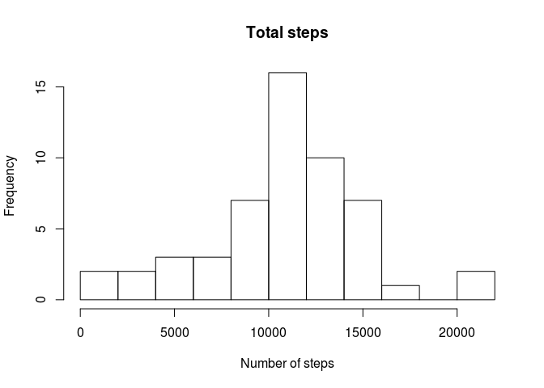
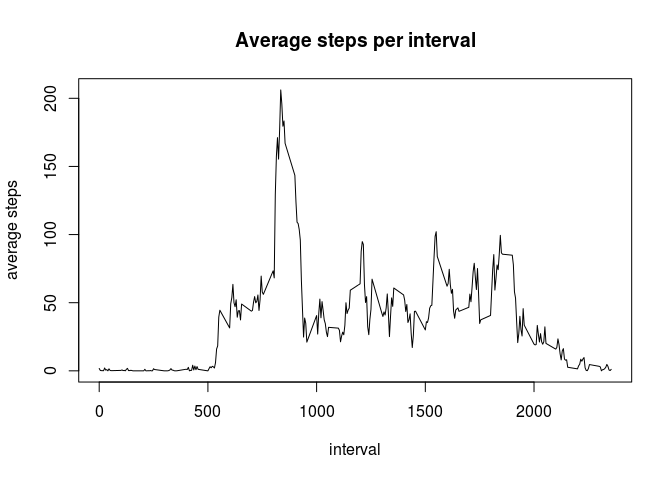
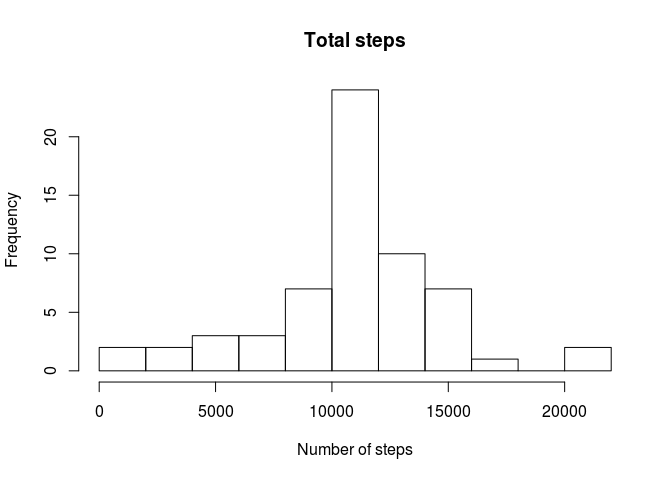
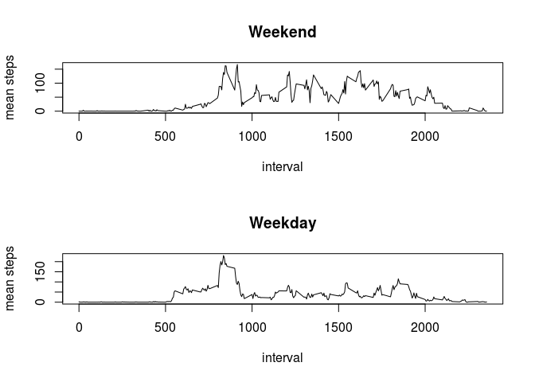

# Reproducible Research: Peer Assessment 1


## Loading and preprocessing the data

Unzip and read the data.

```r
fl.zip = "activity.zip"
fl.csv = "activity.csv"

unzip(fl.zip)
df = read.csv(file=fl.csv, na.strings = "NA")
df$date = as.Date(df$date)
```

## What is mean total number of steps taken per day?

The amount of steps in each day is presented on the histogram below:

```r
steps.total = aggregate(df$steps ~ df$date, FUN=sum)
names(steps.total) = c("date", "total.steps")
hist(steps.total$total.steps, breaks=15, main="Total steps", xlab = "Number of steps")
```



The mean for the total number of steps:

```r
steps.mean = mean(steps.total$total.steps, na.rm = TRUE)
print(steps.mean)
```

```
## [1] 10766.19
```
The median for the total number of steps:

```r
steps.median = median(steps.total$total.steps, na.rm = TRUE)
print(steps.median)
```

```
## [1] 10765
```


## What is the average daily activity pattern?

The pattern is calculated and presented on the plot below:

```r
steps.perInterval = aggregate(df$steps ~ df$interval,  FUN=mean)
names(steps.perInterval) = c("interval", 'mean.steps')
plot(steps.perInterval, type="l", main = "Average steps per interval", xlab="interval", ylab="average steps")
```




The interval in which on average the biggest amount of steps was made:

```r
steps.perInterval[which.max(steps.perInterval$mean.steps), ]$interval
```

```
## [1] 835
```

## Imputing missing values

Total number of NAs:

```r
sum(is.na(df$steps))
```

```
## [1] 2304
```

Fill the NAs with mean value per interval. Note, that we are arbitrarly using floor function,
as it does not make sense to make 'non-integer' number of steps.

* First we merge the mean number of steps per interval. 
* Second we filter the data to find NAs 
* Third we assign the floor(mean) number of steps for interval


```r
df.noNA = merge(df, steps.perInterval)
df.noNA[is.na(df.noNA$steps),]$steps = floor(df.noNA[is.na(df.noNA$steps),]$mean.steps)
df.noNA$mean.steps = NULL
```

There are no NAs any more:

```r
sum(is.na(df.noNA$steps))
```

```
## [1] 0
```

The plot for 'Total steps' show a bit more total steps per day:

```r
steps.noNA.total = aggregate(df.noNA$steps ~ df.noNA$date, FUN=sum)
names(steps.noNA.total) = c("date", "total.steps")
hist(steps.noNA.total$total.steps, breaks=15, main="Total steps", xlab = "Number of steps")
```



The mean is different now:

```r
steps.noNA.mean = mean(steps.noNA.total$total.steps, na.rm = TRUE)
print(steps.noNA.mean)
```

```
## [1] 10749.77
```

The same for median:

```r
steps.noNA.median = median(steps.noNA.total$total.steps, na.rm = TRUE)
print(steps.noNA.median)
```

```
## [1] 10641
```


## Are there differences in activity patterns between weekdays and weekends?

Create a new factor called 'weekend' with two values: 'weekend' and 'weekday'. 
It indicates, if the date is a weekday or a weekend:

```r
df.noNA['weekend'] = "weekday"
df.noNA[grepl("S(at|un)", weekdays(df.noNA$date)),]$weekend = "weekend"
df.noNA$weekend = as.factor(df.noNA$weekend)
```

Calculate means per weekend/weekday and interval: 

```r
df.perIntervalAndWeek = aggregate(df.noNA$steps ~ df.noNA$interval + df.noNA$weekend, FUN=mean)
names(df.perIntervalAndWeek) = c("interval", "weekend", "mean.steps")
```


There is a visible pattern depending on the weekend or weekday:

```r
par(mfcol=c(2,1))
plot(df.perIntervalAndWeek[df.perIntervalAndWeek$weekend == "weekend",]$interval, 
     df.perIntervalAndWeek[df.perIntervalAndWeek$weekend == "weekend",]$mean.steps,
     type="l",
     main="Weekend", xlab = "interval", ylab="mean steps")

plot(df.perIntervalAndWeek[df.perIntervalAndWeek$weekend == "weekday",]$interval,
     df.perIntervalAndWeek[df.perIntervalAndWeek$weekend == "weekday",]$mean.steps,
     type="l",
     main="Weekday", xlab = "interval", ylab="mean steps")
```


